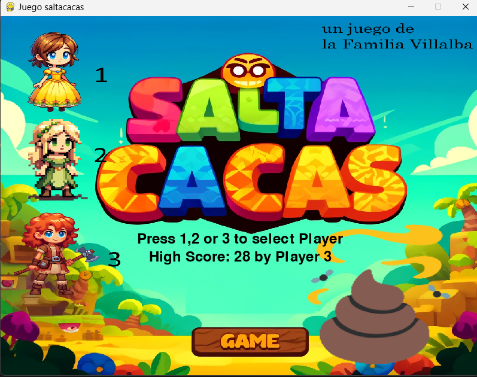
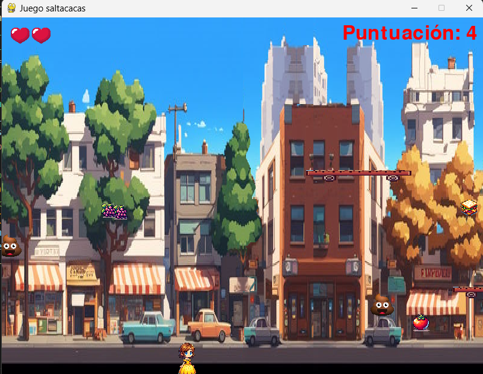

# SALTACACAS

## INTRO
Saltacacas es un proyecto familiar y nuestro primer juego de ordenador hecho en python.

La idea se nos ocurió en el camino habitual al cole, ya que nos pasamos el paseo de casa al colegio saltando cacas de perrito, que sus queridos dueños no quieren recoger de las aceras.

Este juego trata, como su nombre indica, de llegar al cole sano y salvo, sin pisar ninguna caca de perro.

Hay 3 personajes a elegir, en la pantalla de inicio. El personaje puede avanzar, retroceder y saltar, incluso puede subirse a algunos monopatines que aparecen por las calles para evitar pisar las cacarrutas que van saliendo.

Los puntos se consiguen recogiendo fruta que vale 1 punto, o un bocata sandwich que vale 3. Hay que llegar con energía al cole y es necesria para saltar las cacas.

En la ultima versión, al llegar a 30 puntos cambiamos de nivel, y la cosa se vuelve más peligrosa al ir todo más rápido!!.
Las puntuaciones máximas se almacenan en el fichero *high_Scores.csv*, y el record sale siempre en la pantalla inicial.

Puedes ver el post con esta historia del juego en :

https://enrdados.netlify.app/post/2024-05-17-mi-primer-videojuego-en-python/

Autores:
 * Fernando Villalba
 * Sofía Villalba
 * Eva Villalba

## PROGRAMA

### ESTRUCTURA DE ARCHIVOS

Hemos dividido el código del juego en varios archivos de la siguiente manera:

 * main.py: Contendrá el código principal que ejecuta el juego.
 * functions.py: Contendrá funciones auxiliares como check_create_csv, read_high_score y save_score.
 * classes.py: Contendrá las definiciones de las clases Player, Platform, Enemy, Fruit, etc.
 * screens.py: Contendrá funciones relacionadas con la pantalla de inicio y otras pantallas.
 * settings.py: Contendrá las configuraciones y parámetros principales del juego.

Esquema:

- game/
  - main.py
  - functions.py
  - classes.py
  - screens.py
  - settings.py
  - assets/  (tu carpeta de recursos: imágenes, sonidos, etc.)

## Crear ejecutable para distribuir

Para que crear un archivo distribuible en windows he usado la libreria:

Con este código:

>pyinstaller --name saltacacas --onefile --add-data "assets:assets" main.py 

pero ojo, para que las rutas funcionen tanto en local como en el distribuido hay que cambiar todas las cargas de imagen por una nueva función dentro del programa:

<code>
import os
import sys

def resource_path(relative_path):
    """ Get absolute path to resource, works for dev and for PyInstaller """
    base_path = getattr(sys, '_MEIPASS', os.path.dirname(os.path.abspath(__file__)))
    return os.path.join(base_path, relative_path)

# Ejemplo de uso:
background_image = pygame.image.load(resource_path('assets/background.png'))
</code>

Es decir cada vez que usamos load debemos meter ahora la función resource_path(), y de esta forma todo irá bien en el exe.
Por ejemplo en la linea:
>jump_sound = pygame.mixer.Sound('assets/cartoon-jump-6462.mp3')
ponemos 
jump_sound = pygame.mixer.Sound(resource_path('assets/cartoon-jump-6462.mp3'))